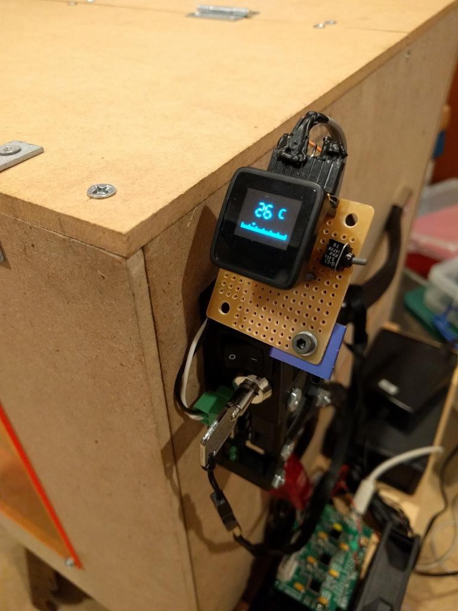
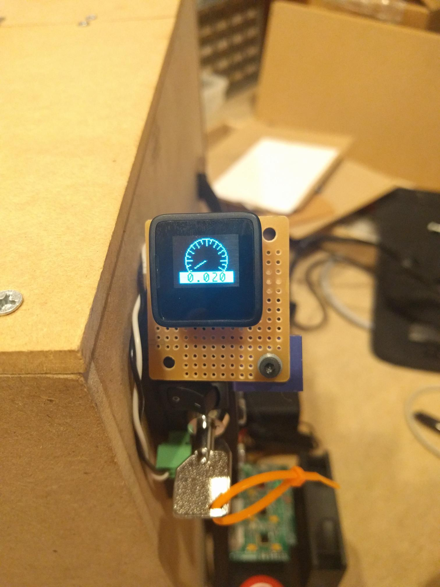

# laserMonitor

This was designed to work for a Shapeoko2 with a J-Tech laser.

All values here are for use with a 9mm 3.8W 445nm J-Tech laser with G2 lens and using the J-Tech High Current Driver Board.

It computes current by reading voltages off of testpoints on the Driver Board, and gets temperature from a DS18B20 sensor.

